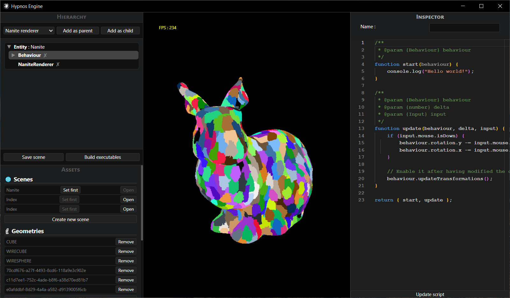

# Hypnos Engine

> A high-performance, lightweight 3D Rendering Engine built from the ground up with Raw WebGL and NeutralinoJS.

Hypnos Engine is a custom graphics framework designed to explore the synergy between traditional rendering techniques (Lightmaps, Half-Lambert) and modern geometric virtualization (Nanite-like clustering). By bypassing heavy abstractions, it achieves a native-grade desktop experience with a minimal memory footprint.


> Figure 1 : Editor capture with clustered mesh.

## 🚀 Key Features

1. Rendering Pipeline
Hybrid Forward Renderer: Optimized for speed using legacy-inspired techniques like Half-Lambert shading and Bakeable Lightmaps.

Virtualized Geometry (Nanite-like): Experimental cluster-based rendering system with Vertex Quantization for high-density mesh management.

Global Illumination: Support for Reflection Probes to simulate complex environmental lighting.

2. Core Architecture
Scene Graph (Composite Pattern): A recursive transformation hierarchy allowing complex parent-child relationships with optimized MVP matrix calculations.

Custom Binary Asset Pipeline: Proprietary serialization for Meshes and Textures, ensuring zero-parsing overhead and direct GPU buffer uploads.

Physics System: Lightweight implementation of AABB, Sphere collisions, and RigidBody dynamics.

3. Native Desktop Runtime
NeutralinoJS Integration: Leveraging a lightweight alternative to Electron to provide native OS access while maintaining a RAM usage of < 50MB.

## 🛠 Technical Deep Dive

The "Nanite" Approach in WebGLTo push the limits of WebGL, I implemented a clustering and quantization pipeline. The engine segments .obj models into spatially-aware clusters, reducing the draw call overhead and allowing for a "Virtualized Geometry" flow that targets geometric density rather than total polygon count.

### Optimization Strategy
- TypedArrays & Binary Data: All internal math and asset loading use TypedArrays to prevent GC (Garbage Collection) spikes.

- Half-Lambert Shading: Utilizes $N \cdot L \cdot 0.5 + 0.5$ to provide better silhouette definition in low-light areas without the cost of real-time shadows.

## 📦 Getting Started

```bash
# Clone the repository
git clone https://github.com/tristan-muller/hypnos-engine

# Install dependencies
npm install

# Run in dev mode (Neutralino)
neu run
```

## 🎯 Project Goals

Hypnos was created to prove that web technologies can handle high-end 3D tasks when coupled with efficient architectural patterns. It serves as a foundation for Industrial Digital Twins and Performance-critical Data Visualizations.